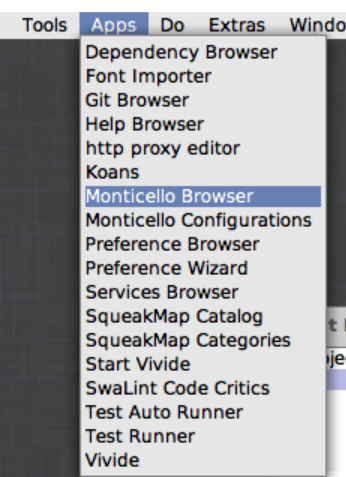
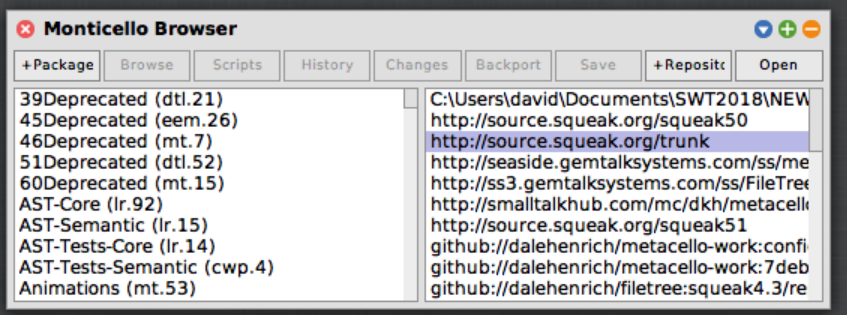
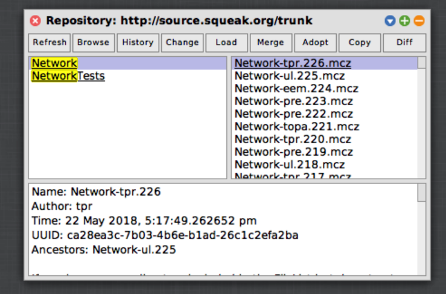
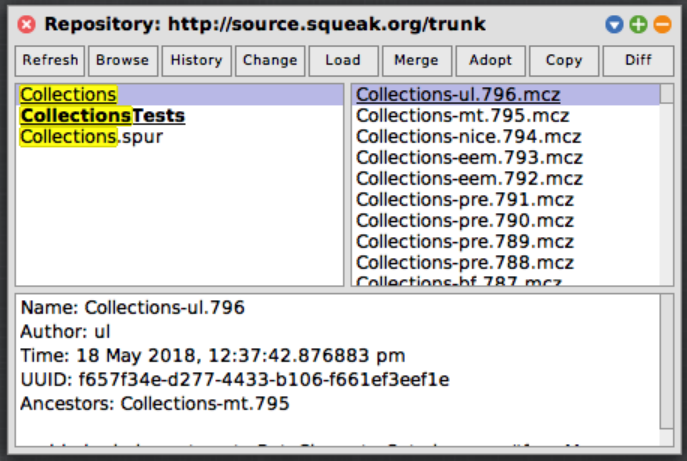

 # IMAPClient [](https://travis-ci.org/hpi-swa-teaching/IMAPClient)
 
 
 ## Introduction
 We proudly present our IMAP Client for Smalltalk Squeak, which we developed and improved during SoSe 2018 for our Software Architecture Lecture.
 
## Installation
```
Metacello new
    baseline: 'IMAPClient';
    repository: 'github://hpi-swa-teaching/IMAPClient:develop/packages';
    load.
```
We needed to use some Squeak Methods, which werent available in Squeak-5.1, so we had to update them manually.
Please follow the following steps:

1. Open Monticello Browser



2. Select `http://source.squeak.org/trunk` on the right and press `open`



3. In the new window search for `Network`, select the newest commit and click `Load`



4. Do the Same for `Collections`



 ## Configuration
 You can customize the number of mails, which are fetched on the initial update process, and the number of mails which are loaded if you press the `Load older Mails` Button. Default are 100 and 10. Change `ICFolder>>numbersOfHeadersToFetch{AtLoaderOlderMail | AtTheBeginning}`
 
 ## Features
 - Manage different accounts
 
  
 - Fetch new mails from the server
 
  
 - Delete & move mails
 
 
 - See unseen mails immediately + Search Mails
 
  
 - Display emails correctly (parse different encodings)
 
 - Reflect server changes back to Client. If you're accessing your mails for a different device, and deleting/moving them, just press the update button in the Client, and every change should be correctly updated.
 
  - Display emails correctly (parse different encodings)

## Usage
Start the IMAP Client with `ICFolderDialog open`. Add new Accounts with the `+` Button. We tested the functionality with the HPI OWA Accounts. But other accounts should work fine.
``` 
Server: owa.hpi.de
Port: 993
Username: surname.lastname
Password: xxxxxxx
Use SSL: True
```

## Safety
You don't have to be worried about your passwords, of course we won't save them. After closing the IMAP-Client and reopening it your are welcomed by a password prompt to re-enter your credentials.

## Issue
There are some open issues left (we wanted to give you a good starting point ;-)) - just kidding, we didn't had enough time to fix all of these, so we left some in the Issues section.

## Architecture

  


## History
2016: Johannes Schneider, Maximilian Söchting, Julian Weise, Alexander Riese, Alexander Loeser

2017: Jonathan Sauder, Marcus Ding, Melvin Witte, Daniel Lindner

2018: Claudia Grabowski, Leonard Von Merzljak, Marius Walter, David Hennemann

## Questions

If you have any question, feel free to drop us a line :-)
